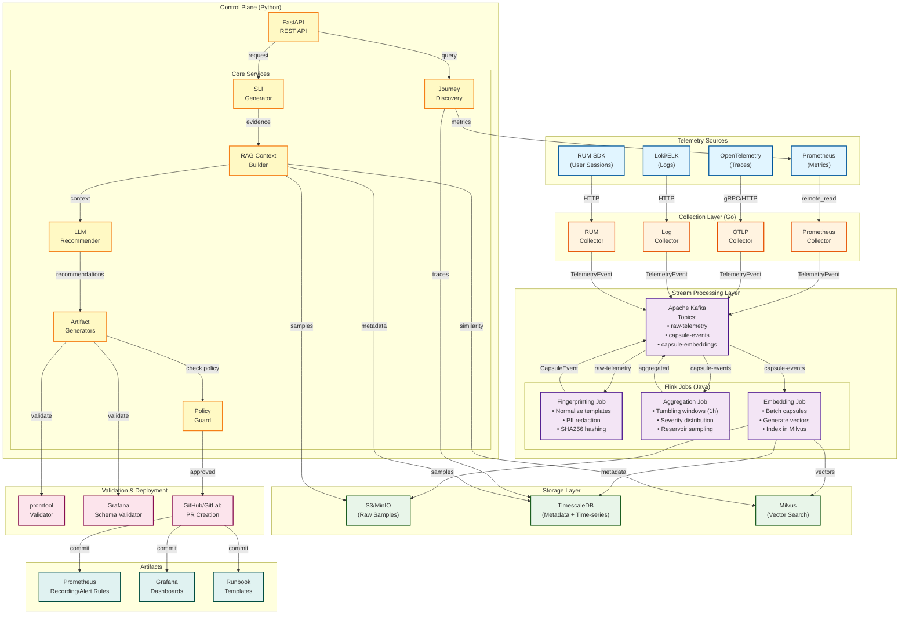

# SLO-Scout Data Flow Diagram

## Overview
This diagram shows the end-to-end data flow through the SLO-Scout system, from telemetry collection through to artifact deployment.

## Diagram

## Flow Description

### Phase 1: Collection (Telemetry Sources → Collectors → Kafka)
1. **Collectors** consume telemetry from multiple sources using native protocols
2. Each collector normalizes data to `TelemetryEvent` Avro schema
3. Events published to Kafka `raw-telemetry` topic with compression and batching

### Phase 2: Stream Processing (Kafka → Flink Jobs)
1. **Fingerprinting Job**:
   - Normalizes log/trace templates (masks variable tokens)
   - Redacts PII (email, IP, auth tokens)
   - Generates SHA256 fingerprint hash
2. **Aggregation Job**:
   - Windows events into 1-hour tumbling windows
   - Maintains severity distribution and counts
   - Keeps reservoir sample (max 10 events per fingerprint)
3. **Embedding Job**:
   - Batches capsules for efficiency
   - Calls embedding service (MiniLM or OpenAI)
   - Writes vectors to Milvus with metadata filters

### Phase 3: Storage (Flink → Storage Layer)
1. **TimescaleDB**: Stores capsule metadata, SLI/SLO definitions, audit trail
2. **S3/MinIO**: Stores raw telemetry samples (JSONL.gz) with lifecycle policies
3. **Milvus**: Indexes 384-dim vectors with HNSW for fast similarity search

### Phase 4: Analysis (API → Services → RAG → LLM)
1. **Journey Discovery**: Analyzes traces to identify critical user paths
2. **SLI Generator**: Proposes latency/error/availability metrics per journey
3. **RAG Builder**: Vector search retrieves relevant capsules as evidence
4. **LLM Recommender**: Generates SLO recommendations with confidence scores

### Phase 5: Artifact Generation (Services → Validators → GitOps)
1. **Artifact Generators**: Create Prometheus rules, Grafana dashboards, runbooks
2. **Validators**: `promtool` validates rules, schema validators check JSON
3. **Policy Guard**: Validates blast radius and approval requirements
4. **PR Creation**: Commits approved artifacts to GitHub/GitLab via PR

## Data Quality Requirements

| Stage | Requirement | Validation |
|-------|-------------|------------|
| Collection | Exactly-once delivery | Kafka idempotency keys |
| Fingerprinting | PII redacted before embedding | `redaction_applied=true` flag |
| Aggregation | Fingerprint uniqueness | Primary key on `fingerprint_hash + service + time_bucket` |
| Embedding | Vector dimensionality | 384-dim for MiniLM, 1536-dim for OpenAI |
| Artifact Generation | promtool validation | Exit code 0 required |

## Performance Characteristics

- **Ingest Throughput**: 100k logs/min (Enterprise tier)
- **Ingest Lag**: p95 < 60s (SLO target: 99%)
- **Query Latency**: p95 < 2s (SLO target: 95%)
- **Embedding Batch Size**: 100 capsules per API call
- **Retention**: 7d raw, 90d capsules, 1y aggregates
