# SLO-Scout Component Diagram

## Overview
This diagram shows all system components, their responsibilities, and relationships.

## Diagram

```mermaid
graph TB
    subgraph External["External Systems"]
        PROM_SRC["Prometheus"]
        OTLP_SRC["OpenTelemetry"]
        LOG_SRC["Loki/ELK"]
        RUM_SRC["RUM SDK"]
        GIT_SRC["GitHub/GitLab"]
        LLM_SRC["LLM API<br/>(OpenAI-compatible)"]
    end

    subgraph CollectorLayer["Collector Layer (Go 1.21+)"]
        direction LR

        subgraph PromCollector["prometheus-collector"]
            PROM_MAIN["main.go<br/>remote_read client"]
            PROM_CONV["converter.go<br/>Metric → TelemetryEvent"]
        end

        subgraph OTLPCollector["otlp-collector"]
            OTLP_MAIN["main.go<br/>gRPC server"]
            OTLP_CONV["converter.go<br/>Span → TelemetryEvent"]
        end

        subgraph LogCollector["log-collector"]
            LOG_MAIN["main.go<br/>FluentBit HTTP"]
            LOG_CONV["parser.go<br/>JSON → TelemetryEvent"]
        end

        subgraph Common["common library"]
            KAFKA_PROD["kafka_producer.go<br/>batching + compression"]
            HEALTH["health.go<br/>/health endpoint"]
        end
    end

    subgraph StreamingLayer["Streaming Layer (Java 11+, Flink 1.18+)"]
        direction TB

        subgraph FingerprintJob["fingerprinting-job"]
            FP_OP["FingerprintOperator.java<br/>template normalization"]
            PII_OP["PIIRedactionOperator.java<br/>email/IP/token masking"]
            HASH_GEN["HashGenerator.java<br/>SHA256 fingerprinting"]
            RESERVOIR["ReservoirSamplingOperator.java<br/>max 10 samples"]
        end

        subgraph AggregationJob["aggregation-job"]
            CAPSULE_AGG["CapsuleAggregator.java<br/>1h tumbling windows"]
            WINDOW_CFG["WindowConfig.java<br/>watermarks + lateness"]
            CHECKPOINT["CheckpointConfig.java<br/>RocksDB incremental"]
        end

        subgraph EmbeddingPipeline["embedding-pipeline-job"]
            BATCH_AGG["BatchAggregator.java<br/>batch 100 capsules"]
            EMB_CLIENT["EmbeddingServiceClient.java<br/>HTTP + retry"]
            VECTOR_WRITER["VectorDBWriter.java<br/>Milvus gRPC"]
        end
    end

    subgraph BackendLayer["Backend Layer (Python 3.11+)"]
        direction TB

        subgraph API["API (FastAPI)"]
            API_ANALYZE["analyze.py<br/>POST/GET analysis jobs"]
            API_JOURNEYS["journeys.py<br/>GET user journeys"]
            API_SLI["sli.py<br/>GET/PATCH SLIs"]
            API_SLO["slo.py<br/>POST/simulate SLOs"]
            API_ARTIFACTS["artifacts.py<br/>POST/PATCH artifacts"]
            API_PR["pr.py<br/>POST PR creation"]
        end

        subgraph Models["Data Models (SQLAlchemy)"]
            MODEL_SERVICE["service.py"]
            MODEL_JOURNEY["user_journey.py"]
            MODEL_SLI["sli.py"]
            MODEL_SLO["slo.py"]
            MODEL_CAPSULE["capsule.py"]
            MODEL_ARTIFACT["artifact.py"]
            MODEL_POLICY["policy.py"]
            MODEL_EVIDENCE["evidence_pointer.py"]
            MODEL_INSTR["instrumentation_recommendation.py"]
        end

        subgraph CoreServices["Core Services"]
            JOURNEY_SVC["journey_service.py<br/>trace graph builder"]
            SLI_GEN["sli_generator.py<br/>PromQL generator"]
            CONF_SCORE["confidence_scorer.py<br/>evidence scoring"]
            RAG_BUILDER["rag_builder.py<br/>context assembly"]
            LLM_CLIENT["llm_client.py<br/>OpenAI-compatible API"]
            LLM_RECOMM["llm_recommender.py<br/>few-shot prompts"]
        end

        subgraph Generators["Artifact Generators"]
            PROM_GEN["recording_rule_generator.py"]
            ALERT_GEN["alert_rule_generator.py"]
            GRAFANA_GEN["grafana_generator.py"]
            RUNBOOK_GEN["runbook_generator.py"]
        end

        subgraph Validators["Validators"]
            PROMQL_VAL["promql_validator.py<br/>promtool check"]
            GRAFANA_VAL["grafana_validator.py<br/>JSON schema"]
            RUNBOOK_VAL["runbook_validator.py<br/>YAML syntax"]
            DRYRUN_EVAL["dryrun_evaluator.py<br/>historical replay"]
        end

        subgraph Governance["Governance"]
            POLICY_EVAL["policy_evaluator.py<br/>blast radius calc"]
            POLICY_GUARD["policy_guard.py<br/>middleware"]
            BLAST_RADIUS["blast_radius.py<br/>impact analysis"]
        end

        subgraph Integrations["Integrations"]
            GITHUB_CLIENT["github_client.py<br/>GraphQL API"]
            GITLAB_CLIENT["gitlab_client.py<br/>REST API"]
            PR_GENERATOR["pr_generator.py<br/>branch + commit"]
        end

        subgraph Storage["Storage Clients"]
            BLOB_STORAGE["blob_storage.py<br/>boto3 S3/MinIO"]
            VECTOR_STORAGE["vector_storage.py<br/>pymilvus"]
            TIMESCALE_MGR["timescale_manager.py<br/>SQLAlchemy"]
        end

        subgraph Embeddings["Embedding Services"]
            EMB_INTERFACE["embedding_service.py<br/>abstract interface"]
            MINILM["minilm_embedder.py<br/>384-dim, ONNX"]
            OPENAI_EMB["openai_embedder.py<br/>1536-dim"]
            EMB_FACTORY["factory.py<br/>config-based selection"]
        end

        subgraph Middleware["Middleware"]
            AUTH["auth.py<br/>JWT verification"]
            VALIDATION["validation.py<br/>OpenAPI schema"]
            ERRORS["errors.py<br/>error handling"]
            CORS["cors.py<br/>CORS headers"]
        end

        subgraph Observability["Self-Observability"]
            METRICS["metrics.py<br/>Prometheus exporter"]
            HEALTH_CHECK["health_check.py<br/>/health endpoint"]
        end
    end

    subgraph StorageLayer["Storage Layer"]
        KAFKA["Apache Kafka 3.5+<br/>Topics: raw-telemetry,<br/>capsule-events,<br/>capsule-embeddings"]
        TIMESCALE["TimescaleDB 2.11+<br/>Hypertables + compression"]
        S3["S3/MinIO<br/>JSONL.gz samples"]
        MILVUS["Milvus<br/>HNSW index, 384-dim"]
    end

    %% External Connections
    PROM_SRC -.->|remote_read| PROM_MAIN
    OTLP_SRC -.->|gRPC| OTLP_MAIN
    LOG_SRC -.->|HTTP| LOG_MAIN
    RUM_SRC -.->|HTTP| LOG_MAIN
    LLM_SRC -.->|HTTP| LLM_CLIENT
    GIT_SRC -.->|API| GITHUB_CLIENT
    GIT_SRC -.->|API| GITLAB_CLIENT

    %% Collector to Kafka
    PROM_CONV --> KAFKA_PROD
    OTLP_CONV --> KAFKA_PROD
    LOG_CONV --> KAFKA_PROD
    KAFKA_PROD --> KAFKA

    %% Kafka to Flink
    KAFKA --> FP_OP
    FP_OP --> PII_OP
    PII_OP --> HASH_GEN
    HASH_GEN --> RESERVOIR
    RESERVOIR --> KAFKA

    KAFKA --> CAPSULE_AGG
    CAPSULE_AGG --> KAFKA

    KAFKA --> BATCH_AGG
    BATCH_AGG --> EMB_CLIENT
    EMB_CLIENT --> VECTOR_WRITER

    %% Flink to Storage
    VECTOR_WRITER --> MILVUS
    VECTOR_WRITER --> TIMESCALE
    VECTOR_WRITER --> S3

    %% API to Services
    API_ANALYZE --> JOURNEY_SVC
    API_SLI --> SLI_GEN
    API_SLO --> CONF_SCORE
    API_ARTIFACTS --> PROM_GEN
    API_ARTIFACTS --> ALERT_GEN
    API_ARTIFACTS --> GRAFANA_GEN
    API_ARTIFACTS --> RUNBOOK_GEN

    %% Services to Storage
    JOURNEY_SVC --> TIMESCALE_MGR
    SLI_GEN --> RAG_BUILDER
    RAG_BUILDER --> VECTOR_STORAGE
    RAG_BUILDER --> BLOB_STORAGE
    RAG_BUILDER --> TIMESCALE_MGR
    RAG_BUILDER --> LLM_RECOMM

    %% Validators
    PROM_GEN --> PROMQL_VAL
    ALERT_GEN --> PROMQL_VAL
    GRAFANA_GEN --> GRAFANA_VAL
    RUNBOOK_GEN --> RUNBOOK_VAL
    PROMQL_VAL --> DRYRUN_EVAL

    %% Policy Guard
    API_ARTIFACTS --> POLICY_GUARD
    POLICY_GUARD --> POLICY_EVAL
    POLICY_EVAL --> BLAST_RADIUS

    %% PR Generation
    API_PR --> PR_GENERATOR
    PR_GENERATOR --> GITHUB_CLIENT
    PR_GENERATOR --> GITLAB_CLIENT

    %% Storage connections
    TIMESCALE_MGR --> TIMESCALE
    VECTOR_STORAGE --> MILVUS
    BLOB_STORAGE --> S3
    EMB_FACTORY --> MINILM
    EMB_FACTORY --> OPENAI_EMB

    %% Middleware
    API_ANALYZE -.->|uses| AUTH
    API_SLI -.->|uses| AUTH
    API_SLO -.->|uses| AUTH
    API_ARTIFACTS -.->|uses| VALIDATION
    API_PR -.->|uses| POLICY_GUARD

    %% Styling
    classDef external fill:#e1f5ff,stroke:#01579b,stroke-width:2px
    classDef collector fill:#fff3e0,stroke:#e65100,stroke-width:2px
    classDef stream fill:#f3e5f5,stroke:#4a148c,stroke-width:2px
    classDef api fill:#fff9c4,stroke:#f57f17,stroke-width:2px
    classDef service fill:#e8f5e9,stroke:#1b5e20,stroke-width:2px
    classDef storage fill:#fce4ec,stroke:#880e4f,stroke-width:2px

    class PROM_SRC,OTLP_SRC,LOG_SRC,RUM_SRC,GIT_SRC,LLM_SRC external
    class PROM_MAIN,PROM_CONV,OTLP_MAIN,OTLP_CONV,LOG_MAIN,LOG_CONV,KAFKA_PROD,HEALTH collector
    class FP_OP,PII_OP,HASH_GEN,RESERVOIR,CAPSULE_AGG,WINDOW_CFG,CHECKPOINT,BATCH_AGG,EMB_CLIENT,VECTOR_WRITER stream
    class API_ANALYZE,API_JOURNEYS,API_SLI,API_SLO,API_ARTIFACTS,API_PR api
    class JOURNEY_SVC,SLI_GEN,CONF_SCORE,RAG_BUILDER,LLM_CLIENT,LLM_RECOMM,PROM_GEN,ALERT_GEN,GRAFANA_GEN,RUNBOOK_GEN service
    class KAFKA,TIMESCALE,S3,MILVUS storage
```

## Component Responsibilities

### Collector Layer (Go)
- **Responsibility**: Collect telemetry from heterogeneous sources, normalize to unified schema
- **Key Files**: `collectors/{prometheus,otlp,log}-collector/main.go`, `collectors/common/kafka_producer.go`
- **Technology**: Go 1.21+, confluent-kafka-go, prometheus/client_golang
- **Scale**: Deployed as DaemonSet (log collector) or Deployment (metric/trace collectors)

### Streaming Layer (Java/Flink)
- **Responsibility**: Real-time fingerprinting, PII redaction, aggregation, embedding indexing
- **Key Files**: `streaming/{fingerprinting,aggregation,embedding-pipeline}-job/src/main/java/`
- **Technology**: Apache Flink 1.18+, Avro, RocksDB state backend
- **Scale**: Horizontal scaling via Flink task parallelism, exactly-once processing

### Backend Layer (Python)
- **Responsibility**: REST API, business logic, artifact generation, policy enforcement
- **Key Files**: `backend/src/{api,services,generators,validators}/`
- **Technology**: FastAPI, SQLAlchemy, sentence-transformers, boto3, pymilvus
- **Scale**: Stateless API servers (horizontal scaling), async I/O for LLM calls

### Storage Layer
- **Kafka**: Event streaming backbone, 3-partition default, 7-day retention
- **TimescaleDB**: TSDB + relational for capsules, SLI/SLO, audit trail
- **S3/MinIO**: Object storage for raw telemetry samples (JSONL.gz)
- **Milvus**: Vector database with HNSW index for semantic search

## Inter-Component Contracts

| Source | Target | Contract Type | Schema |
|--------|--------|---------------|--------|
| Collectors | Kafka | Avro | `TelemetryEvent.avsc` |
| Fingerprinting Job | Kafka | Avro | `CapsuleEvent.avsc` |
| Embedding Job | Milvus | gRPC | `CapsuleEmbedding` proto |
| API | Backend Services | Python types | Pydantic models |
| Artifact Generators | Validators | File I/O | YAML/JSON |
| Backend | LLM | HTTP | OpenAI-compatible API |

## Testing Strategy

- **Unit Tests**: Per-component tests with mocks (pytest, JUnit)
- **Contract Tests**: Validate API contracts before implementation (T011-T025)
- **Integration Tests**: Testcontainers for Kafka, TimescaleDB, Milvus
- **Chaos Tests**: Kafka partition failure, DB outage, Milvus unavailability
- **Performance Tests**: 100k logs/min sustained, p95 latency < 2s
