# SLO-Scout Deployment Topology

## Overview
This diagram shows the Kubernetes deployment architecture, including namespaces, services, persistent storage, and networking.

## Diagram

```mermaid
graph TB
    subgraph K8sCluster["Kubernetes Cluster"]
        subgraph Ingress["Ingress Layer"]
            NGINX["NGINX Ingress Controller<br/>TLS termination"]
            CERT["cert-manager<br/>Let's Encrypt"]
        end

        subgraph NSCollectors["Namespace: slo-scout-collectors"]
            direction TB
            PROM_COL_DEP["Deployment:<br/>prometheus-collector<br/>replicas: 2<br/>CPU: 500m, Mem: 512Mi"]
            OTLP_COL_DEP["Deployment:<br/>otlp-collector<br/>replicas: 3<br/>CPU: 1, Mem: 1Gi"]
            LOG_COL_DS["DaemonSet:<br/>log-collector<br/>hostPath: /var/log<br/>CPU: 200m, Mem: 256Mi"]

            PROM_COL_SVC["Service:<br/>prometheus-collector<br/>ClusterIP<br/>Port: 9090"]
            OTLP_COL_SVC["Service:<br/>otlp-collector<br/>ClusterIP<br/>Ports: 4317/4318"]
            LOG_COL_SVC["Service:<br/>log-collector<br/>ClusterIP<br/>Port: 8080"]
        end

        subgraph NSStreaming["Namespace: slo-scout-streaming"]
            direction TB
            KAFKA_STS["StatefulSet: kafka<br/>replicas: 3<br/>CPU: 2, Mem: 4Gi<br/>PVC: 100Gi per replica"]
            KAFKA_SVC["Service: kafka<br/>Headless + LoadBalancer<br/>Ports: 9092 (internal),<br/>9093 (external)"]

            FLINK_JM_DEP["Deployment:<br/>flink-jobmanager<br/>replicas: 1<br/>CPU: 1, Mem: 2Gi"]
            FLINK_TM_DEP["Deployment:<br/>flink-taskmanager<br/>replicas: 4<br/>CPU: 4, Mem: 8Gi<br/>parallelism: 16"]
            FLINK_SVC["Service:<br/>flink-jobmanager<br/>ClusterIP<br/>Ports: 6123, 8081"]

            SCHEMA_REG_DEP["Deployment:<br/>schema-registry<br/>replicas: 2<br/>CPU: 500m, Mem: 512Mi"]
            SCHEMA_REG_SVC["Service:<br/>schema-registry<br/>ClusterIP<br/>Port: 8081"]
        end

        subgraph NSData["Namespace: slo-scout-data"]
            direction TB
            TSDB_STS["StatefulSet:<br/>timescaledb<br/>replicas: 1<br/>CPU: 4, Mem: 16Gi<br/>PVC: 500Gi"]
            TSDB_SVC["Service: timescaledb<br/>ClusterIP<br/>Port: 5432"]

            MILVUS_STS["StatefulSet: milvus<br/>replicas: 1<br/>CPU: 2, Mem: 8Gi<br/>PVC: 200Gi"]
            MILVUS_SVC["Service: milvus<br/>ClusterIP<br/>Ports: 19530, 9091"]

            MINIO_STS["StatefulSet: minio<br/>replicas: 4 (distributed)<br/>CPU: 1, Mem: 2Gi<br/>PVC: 1Ti per replica"]
            MINIO_SVC["Service: minio<br/>ClusterIP + LoadBalancer<br/>Ports: 9000, 9001"]

            REDIS_DEP["Deployment: redis<br/>replicas: 1<br/>CPU: 500m, Mem: 1Gi<br/>PVC: 10Gi"]
            REDIS_SVC["Service: redis<br/>ClusterIP<br/>Port: 6379"]
        end

        subgraph NSBackend["Namespace: slo-scout-backend"]
            direction TB
            API_DEP["Deployment: api<br/>replicas: 3<br/>CPU: 2, Mem: 4Gi<br/>HPA: 3-10 replicas<br/>target CPU: 70%"]
            API_SVC["Service: api<br/>ClusterIP<br/>Port: 8000"]

            WORKER_DEP["Deployment: worker<br/>replicas: 2<br/>CPU: 2, Mem: 4Gi<br/>Celery beat + workers"]

            EMB_DEP["Deployment:<br/>embedding-service<br/>replicas: 2<br/>CPU: 4, Mem: 8Gi<br/>GPU: optional"]
            EMB_SVC["Service:<br/>embedding-service<br/>ClusterIP<br/>Port: 8001"]
        end

        subgraph NSFrontend["Namespace: slo-scout-frontend"]
            direction TB
            UI_DEP["Deployment: ui<br/>replicas: 2<br/>CPU: 200m, Mem: 512Mi"]
            UI_SVC["Service: ui<br/>ClusterIP<br/>Port: 80"]
        end

        subgraph NSMonitoring["Namespace: slo-scout-monitoring"]
            direction TB
            PROM_DEP["Deployment: prometheus<br/>replicas: 1<br/>CPU: 2, Mem: 8Gi<br/>PVC: 100Gi"]
            PROM_SVC["Service: prometheus<br/>ClusterIP + LoadBalancer<br/>Port: 9090"]

            GRAFANA_DEP["Deployment: grafana<br/>replicas: 1<br/>CPU: 500m, Mem: 1Gi<br/>PVC: 10Gi"]
            GRAFANA_SVC["Service: grafana<br/>ClusterIP + LoadBalancer<br/>Port: 3000"]

            ALERT_DEP["Deployment:<br/>alertmanager<br/>replicas: 2<br/>CPU: 200m, Mem: 512Mi"]
            ALERT_SVC["Service: alertmanager<br/>ClusterIP<br/>Port: 9093"]
        end
    end

    subgraph External["External Access"]
        USERS["End Users<br/>(SRE Teams)"]
        TELEMETRY["Telemetry Sources<br/>(Production Services)"]
        GIT_REMOTE["GitHub/GitLab"]
        LLM_API["LLM API<br/>(OpenAI/local)"]
    end

    subgraph Storage["Persistent Storage"]
        PV_KAFKA["PersistentVolume<br/>kafka-data-*<br/>StorageClass: fast-ssd"]
        PV_TSDB["PersistentVolume<br/>timescaledb-data<br/>StorageClass: fast-ssd"]
        PV_MILVUS["PersistentVolume<br/>milvus-data<br/>StorageClass: fast-ssd"]
        PV_MINIO["PersistentVolume<br/>minio-data-*<br/>StorageClass: standard"]
    end

    %% External Connections
    USERS -->|HTTPS| NGINX
    TELEMETRY -->|metrics/traces/logs| NGINX
    NGINX -->|route /api/*| API_SVC
    NGINX -->|route /*| UI_SVC
    NGINX -->|route /otlp| OTLP_COL_SVC

    %% Collector to Kafka
    PROM_COL_DEP --> KAFKA_SVC
    OTLP_COL_DEP --> KAFKA_SVC
    LOG_COL_DS --> KAFKA_SVC

    %% Flink to Kafka and Storage
    FLINK_TM_DEP --> KAFKA_SVC
    FLINK_TM_DEP --> TSDB_SVC
    FLINK_TM_DEP --> MILVUS_SVC
    FLINK_TM_DEP --> MINIO_SVC

    %% Backend to Storage
    API_DEP --> TSDB_SVC
    API_DEP --> MILVUS_SVC
    API_DEP --> MINIO_SVC
    API_DEP --> REDIS_SVC
    API_DEP --> EMB_SVC
    API_DEP -.->|external| LLM_API
    API_DEP -.->|external| GIT_REMOTE

    WORKER_DEP --> TSDB_SVC
    WORKER_DEP --> REDIS_SVC

    %% Monitoring
    PROM_DEP --> PROM_COL_SVC
    PROM_DEP --> OTLP_COL_SVC
    PROM_DEP --> KAFKA_SVC
    PROM_DEP --> FLINK_SVC
    PROM_DEP --> API_SVC
    PROM_DEP --> TSDB_SVC
    PROM_DEP --> MILVUS_SVC

    GRAFANA_DEP --> PROM_SVC
    GRAFANA_DEP --> TSDB_SVC

    ALERT_DEP --> PROM_SVC

    %% Storage Bindings
    KAFKA_STS -.->|PVC| PV_KAFKA
    TSDB_STS -.->|PVC| PV_TSDB
    MILVUS_STS -.->|PVC| PV_MILVUS
    MINIO_STS -.->|PVC| PV_MINIO

    %% Styling
    classDef ingress fill:#e1f5ff,stroke:#01579b,stroke-width:2px
    classDef collector fill:#fff3e0,stroke:#e65100,stroke-width:2px
    classDef streaming fill:#f3e5f5,stroke:#4a148c,stroke-width:2px
    classDef data fill:#e8f5e9,stroke:#1b5e20,stroke-width:2px
    classDef backend fill:#fff9c4,stroke:#f57f17,stroke-width:2px
    classDef frontend fill:#fce4ec,stroke:#880e4f,stroke-width:2px
    classDef monitoring fill:#e0f2f1,stroke:#004d40,stroke-width:2px
    classDef external fill:#ffebee,stroke:#b71c1c,stroke-width:2px
    classDef storage fill:#f3e5f5,stroke:#4a148c,stroke-width:2px

    class NGINX,CERT ingress
    class PROM_COL_DEP,OTLP_COL_DEP,LOG_COL_DS,PROM_COL_SVC,OTLP_COL_SVC,LOG_COL_SVC collector
    class KAFKA_STS,KAFKA_SVC,FLINK_JM_DEP,FLINK_TM_DEP,FLINK_SVC,SCHEMA_REG_DEP,SCHEMA_REG_SVC streaming
    class TSDB_STS,TSDB_SVC,MILVUS_STS,MILVUS_SVC,MINIO_STS,MINIO_SVC,REDIS_DEP,REDIS_SVC data
    class API_DEP,API_SVC,WORKER_DEP,EMB_DEP,EMB_SVC backend
    class UI_DEP,UI_SVC frontend
    class PROM_DEP,PROM_SVC,GRAFANA_DEP,GRAFANA_SVC,ALERT_DEP,ALERT_SVC monitoring
    class USERS,TELEMETRY,GIT_REMOTE,LLM_API external
    class PV_KAFKA,PV_TSDB,PV_MILVUS,PV_MINIO storage
```



## Deployment Architecture Details

### Namespace Organization

| Namespace | Purpose | Components | Resource Quota |
|-----------|---------|------------|----------------|
| `slo-scout-collectors` | Telemetry collection | Prometheus, OTLP, Log collectors | CPU: 10, Mem: 20Gi |
| `slo-scout-streaming` | Stream processing | Kafka, Flink, Schema Registry | CPU: 40, Mem: 80Gi |
| `slo-scout-data` | Data persistence | TimescaleDB, Milvus, MinIO, Redis | CPU: 20, Mem: 60Gi |
| `slo-scout-backend` | Control plane | API, Workers, Embedding service | CPU: 20, Mem: 40Gi |
| `slo-scout-frontend` | User interface | React UI | CPU: 2, Mem: 2Gi |
| `slo-scout-monitoring` | Self-observability | Prometheus, Grafana, Alertmanager | CPU: 10, Mem: 20Gi |

### Networking

#### Ingress Routes
```yaml
# External endpoints (HTTPS via NGINX Ingress)
https://slo-scout.example.com/          → ui (frontend)
https://slo-scout.example.com/api/v1/*  → api (backend)
https://slo-scout.example.com/otlp      → otlp-collector
https://slo-scout.example.com/grafana   → grafana
```

#### Service Mesh (Optional)
- **Istio** for mTLS between services (production deployments)
- **Linkerd** for observability (development/staging)
- **NetworkPolicy**: Restrict inter-namespace traffic to required flows

### Scaling Strategy

#### Horizontal Pod Autoscaler (HPA)
```yaml
api:
  minReplicas: 3
  maxReplicas: 10
  metrics:
    - type: Resource
      resource:
        name: cpu
        target:
          type: Utilization
          averageUtilization: 70
    - type: Pods
      pods:
        metric:
          name: http_requests_per_second
        target:
          type: AverageValue
          averageValue: 1000

flink-taskmanager:
  minReplicas: 4
  maxReplicas: 20
  metrics:
    - type: External
      external:
        metric:
          name: kafka_consumer_lag
        target:
          type: AverageValue
          averageValue: 1000
```

#### Vertical Pod Autoscaler (VPA)
- **TimescaleDB**: Memory auto-tuning based on query load
- **Milvus**: Memory auto-tuning based on vector index size
- **Embedding Service**: GPU allocation based on queue depth

### Storage Classes

| StorageClass | Type | Use Case | Performance |
|--------------|------|----------|-------------|
| `fast-ssd` | SSD with high IOPS | Kafka, TimescaleDB, Milvus | 10k IOPS, < 1ms latency |
| `standard` | HDD or standard SSD | MinIO (S3), backups | 500 IOPS, < 10ms latency |
| `archive` | Cold storage | Long-term retention | Best effort |

### High Availability Configuration

#### Kafka
- **Replication Factor**: 3
- **Min In-Sync Replicas**: 2
- **Unclean Leader Election**: Disabled
- **Rack Awareness**: Enabled (spread across availability zones)

#### TimescaleDB
- **Primary-Replica**: 1 primary + 2 replicas (read scaling)
- **Backup**: Daily full + hourly incremental (pgBackRest)
- **Failover**: Patroni for automatic failover (< 30s RTO)

#### Milvus
- **Standalone**: Single instance with PVC snapshots
- **Cluster Mode** (Enterprise): 3 query nodes, 2 data nodes, 1 root coord

#### MinIO
- **Erasure Coding**: 4 nodes, 2 parity (tolerates 2 node failures)
- **Replication**: Cross-region replication for disaster recovery

### Resource Sizing

#### Starter Tier (10k logs/min)
- **Total CPU**: 50 cores
- **Total Memory**: 100Gi
- **Total Storage**: 2Ti
- **Estimated Cost**: $500/month (on-prem) or $2k/month (cloud)

#### Pro Tier (50k logs/min)
- **Total CPU**: 150 cores
- **Total Memory**: 300Gi
- **Total Storage**: 10Ti
- **Estimated Cost**: $1.5k/month (on-prem) or $6k/month (cloud)

#### Enterprise Tier (100k+ logs/min)
- **Total CPU**: 300+ cores
- **Total Memory**: 600Gi+
- **Total Storage**: 50Ti+
- **Estimated Cost**: Custom (contact sales)

### Security

#### Network Policies
```yaml
# Example: Only allow backend to access TimescaleDB
apiVersion: networking.k8s.io/v1
kind: NetworkPolicy
metadata:
  name: timescaledb-allow-backend
  namespace: slo-scout-data
spec:
  podSelector:
    matchLabels:
      app: timescaledb
  ingress:
    - from:
        - namespaceSelector:
            matchLabels:
              name: slo-scout-backend
      ports:
        - protocol: TCP
          port: 5432
```

#### Secrets Management
- **External Secrets Operator**: Sync secrets from AWS Secrets Manager, HashiCorp Vault, GCP Secret Manager
- **Sealed Secrets**: Encrypt secrets in Git for GitOps workflows
- **RBAC**: Least-privilege service accounts per namespace

### Disaster Recovery

#### Backup Strategy
| Component | Frequency | Retention | RTO | RPO |
|-----------|-----------|-----------|-----|-----|
| Kafka | Continuous replication | 7 days | 5 min | 0 |
| TimescaleDB | Hourly incremental | 30 days | 1 hour | 1 hour |
| Milvus | Daily snapshots | 7 days | 4 hours | 24 hours |
| MinIO | Cross-region replication | 90 days | 1 hour | 0 |

#### Runbook Links
- [Kafka Partition Failure Recovery](../runbooks/kafka-partition-failure.md)
- [TimescaleDB Primary Failover](../runbooks/timescaledb-failover.md)
- [Milvus Index Corruption](../runbooks/milvus-index-rebuild.md)
- [Full Cluster Restore](../runbooks/full-cluster-restore.md)
