# Sequence Diagram: SLO Creation & Simulation

## Overview
This diagram shows the workflow for reviewing SLI recommendations, creating SLOs, and running backtest simulations.

## Diagram

```mermaid
sequenceDiagram
    actor SRE as SRE Team Member
    participant UI as Web UI
    participant API as FastAPI Backend
    participant TSDB as TimescaleDB
    participant Prom as Prometheus
    participant RAG as RAG Builder
    participant Milvus as Milvus
    participant S3 as S3/MinIO

    %% Review SLI Recommendations
    SRE->>UI: Navigate to "SLI Recommendations"
    UI->>+API: GET /api/v1/sli?journey_id={id}&include_evidence=true
    API->>TSDB: SELECT sli.*, evidence_pointer.*<br/>FROM sli JOIN evidence_pointer<br/>WHERE journey_id={id}
    TSDB-->>API: SLI records with evidence

    loop For each SLI
        API->>TSDB: SELECT capsule metadata<br/>WHERE capsule_id IN (evidence_ids)
        TSDB-->>API: Capsule templates + counts
    end

    API-->>-UI: 200 OK<br/>{sli_recommendations: [<br/>  {id, name, metric_definition, confidence,<br/>   evidence: [{capsule_id, template, contribution}]}]}

    UI->>SRE: Display SLI table:<br/>- checkout_latency_p95 (confidence: 92%)<br/>- checkout_error_rate (confidence: 88%)<br/>- payment_success_rate (confidence: 75%)

    %% Drill Down to Evidence
    SRE->>UI: Click "View Evidence" for checkout_latency_p95
    UI->>+API: GET /api/v1/evidence?sli_id={id}
    API->>TSDB: SELECT * FROM evidence_pointer<br/>WHERE sli_id={id} ORDER BY contribution DESC
    TSDB-->>API: Evidence pointers (top 10)

    API->>S3: GET samples for top evidence capsules
    S3-->>API: Raw log/trace samples (PII redacted)
    API-->>-UI: {evidence: [<br/>  {capsule_id, template, samples, contribution: 35%},<br/>  ...]}

    UI->>SRE: Display evidence:<br/>- "Trace: checkout → payment_gateway (p95: 182ms)"<br/>- 5 sample trace IDs with durations<br/>- Capsule count: 12,450 occurrences

    %% SLI Approval/Modification
    alt SRE approves as-is
        SRE->>UI: Click "Approve" for checkout_latency_p95
        UI->>+API: PATCH /api/v1/sli/{id}<br/>{approved_by: "alice@example.com"}
        API->>API: Validate user has approval permission
        API->>TSDB: UPDATE sli SET approved_by='alice@example.com',<br/>approved_at=NOW() WHERE id={id}
        TSDB-->>API: 1 row updated
        API-->>-UI: 200 OK {sli: {approved_by, approved_at}}
        UI->>SRE: Show "✓ Approved by alice@example.com"

    else SRE modifies PromQL
        SRE->>UI: Click "Edit" → Modify metric_definition
        UI->>SRE: Show editor with current PromQL
        SRE->>UI: Update: histogram_quantile(0.95, ...) → 0.99
        UI->>+API: PATCH /api/v1/sli/{id}<br/>{metric_definition_override: "...",<br/>approved_by: "alice@example.com"}
        API->>API: Validate PromQL syntax (promtool)
        API->>TSDB: UPDATE sli SET metric_definition_override='...',<br/>approved_by='alice@example.com'
        API-->>-UI: 200 OK
        UI->>SRE: Show "✓ Modified and approved"
    end

    %% Create SLO
    SRE->>UI: Click "Create SLO" for approved SLI
    UI->>SRE: Display form:<br/>- Threshold value<br/>- Comparison operator (>, <, >=, <=)<br/>- Time window (1h, 6h, 24h, 7d, 30d)<br/>- Target percentage (99%, 99.9%, 99.99%)<br/>- Severity (critical, high, medium, low)<br/>- Variant (conservative, balanced, aggressive)

    SRE->>UI: Submit form:<br/>threshold=200ms, operator="<", window=30d,<br/>target=99.9%, severity=high, variant=balanced

    UI->>+API: POST /api/v1/slo<br/>{sli_id, threshold_value, comparison_operator,<br/>time_window, target_percentage, severity, variant}
    API->>API: Validate request schema
    API->>TSDB: SELECT * FROM sli WHERE id={sli_id}
    TSDB-->>API: SLI record (check approved=true)

    alt SLI not approved
        API-->>UI: 400 Bad Request<br/>{error: "SLI must be approved before SLO creation"}
        UI->>SRE: Show error message
    else SLI approved
        API->>TSDB: INSERT INTO slo<br/>(sli_id, threshold_value, comparison_operator,<br/>time_window, target_percentage, severity,<br/>variant, error_budget_remaining=100%)
        TSDB-->>API: SLO created (id={slo_id})
        API-->>-UI: 201 Created {slo: {id, ...}}
        UI->>SRE: Show "SLO created successfully"
    end

    %% Backtest Simulation
    SRE->>UI: Click "Simulate" to backtest SLO
    UI->>+API: POST /api/v1/slo/{slo_id}/simulate<br/>{simulation_params: {historical_window: 90d}}
    API->>TSDB: SELECT slo.*, sli.metric_definition<br/>FROM slo JOIN sli WHERE slo.id={slo_id}
    TSDB-->>API: SLO + SLI metadata

    API->>Prom: Query historical SLI values<br/>query={metric_definition}, range=90d
    Prom-->>API: Time-series data (daily aggregates)

    API->>API: Run backtest simulation:<br/>- For each day, check if SLI breached threshold<br/>- Calculate breach frequency<br/>- Estimate error budget consumption

    Note over API: Monte Carlo Simulation (1000 iterations)<br/>Accounts for variance, seasonality

    API->>API: Generate simulation results:<br/>- simulated_breaches: 2<br/>- breach_timestamps: [2025-09-15, 2025-09-28]<br/>- error_budget_consumption: 0.02%<br/>- confidence_interval: [0.01%, 0.05%]

    API->>TSDB: INSERT INTO simulation_result<br/>(slo_id, simulated_breaches, breach_timestamps, ...)
    API-->>-UI: 200 OK<br/>{simulated_breaches: 2,<br/>breach_timestamps: [...],<br/>error_budget_consumption: 0.02%,<br/>confidence_interval: [...]}

    UI->>SRE: Display simulation results:<br/>- "Historical Breach Frequency: 2 in 90 days (2.2%)"<br/>- "Error Budget Remaining: 99.98%"<br/>- "Confidence Interval: [0.01%, 0.05%]"<br/>- Chart showing breach timestamps

    %% What-If Scenarios
    SRE->>UI: Click "What-If Simulation"
    UI->>SRE: Show sliders:<br/>- Traffic multiplier (0.1x - 10x)<br/>- Replica count (1 - 100)<br/>- Deployment version (current, previous)

    SRE->>UI: Adjust sliders:<br/>traffic_multiplier=2.0, replica_count=5
    UI->>+API: POST /api/v1/slo/{slo_id}/simulate<br/>{what_if_params: {traffic_multiplier: 2.0, replica_count: 5}}

    API->>API: Adjust historical metrics:<br/>- Scale request rate by 2.0x<br/>- Assume linear latency increase with traffic<br/>- Account for replica scaling

    API->>API: Re-run Monte Carlo simulation<br/>with adjusted parameters
    API-->>-UI: 200 OK<br/>{simulated_breaches: 8,<br/>error_budget_consumption: 0.08%,<br/>recommendation: "Add 2 more replicas"}

    UI->>SRE: Display what-if results:<br/>- "Projected Breaches: 8 in 90 days"<br/>- "Recommendation: Scale to 7 replicas for 99.9% SLO"

    %% SRE Decision
    alt SRE adjusts SLO threshold
        SRE->>UI: Click "Adjust Threshold" → Set to 250ms
        UI->>+API: PATCH /api/v1/slo/{slo_id}<br/>{threshold_value: 250}
        API->>TSDB: UPDATE slo SET threshold_value=250
        API-->>-UI: 200 OK
        UI->>SRE: "SLO updated, re-run simulation recommended"

    else SRE approves SLO
        SRE->>UI: Click "Approve for Production"
        UI->>+API: PATCH /api/v1/slo/{slo_id}<br/>{approved_by: "alice@example.com"}
        API->>TSDB: UPDATE slo SET approved_by='alice@example.com',<br/>approved_at=NOW()
        API-->>-UI: 200 OK
        UI->>SRE: "✓ SLO approved, ready for artifact generation"
    end
```

## Flow Summary

### Phase 1: SLI Review (30 seconds - 2 minutes)
1. Fetch SLI recommendations with evidence links
2. Display confidence scores, PromQL definitions
3. Drill down to evidence (capsule templates, sample traces)
4. SRE verifies recommendations align with business intent

### Phase 2: SLI Approval/Modification (1-5 minutes)
1. **Option A: Approve as-is** → Update `approved_by` field
2. **Option B: Modify PromQL** → Override metric definition, validate syntax
3. Approval required before SLO creation (constitutional gate)

### Phase 3: SLO Creation (1-2 minutes)
1. Select approved SLI
2. Configure SLO parameters (threshold, time window, target %, severity)
3. Choose variant (conservative/balanced/aggressive)
4. System validates SLI is approved, persists SLO record

### Phase 4: Backtest Simulation (30-120 seconds)
1. Query historical SLI values from Prometheus (30-90 day window)
2. Run Monte Carlo simulation (1000 iterations)
3. Calculate breach frequency, error budget consumption
4. Display confidence intervals and breach timestamps

### Phase 5: What-If Scenarios (30-120 seconds per scenario)
1. SRE adjusts traffic multiplier, replica count, or deployment version
2. System re-calculates adjusted metrics
3. Re-runs simulation with new parameters
4. Provides scaling recommendations

### Phase 6: SLO Approval
1. SRE reviews simulation results
2. **Option A: Adjust threshold** → Modify and re-simulate
3. **Option B: Approve** → Mark SLO ready for artifact generation

## Data Quality Checks

| Check | Implementation | Failure Handling |
|-------|----------------|------------------|
| SLI approved before SLO creation | `TSDB: WHERE approved_by IS NOT NULL` | 400 Bad Request |
| PromQL syntax validation | `promtool check query` (exit code 0) | 400 Bad Request with promtool stderr |
| Historical data availability | `Prometheus query != empty` | Degrade to rule-based simulation |
| Simulation timeout (120s) | `asyncio.timeout(120)` | 504 Gateway Timeout |
| Confidence score threshold | `WHERE confidence >= 70` | Display warning, allow override |

## Performance Characteristics

| Operation | Target | Actual (Median) | P95 |
|-----------|--------|-----------------|-----|
| GET /api/v1/sli (with evidence) | < 1s | 350ms | 800ms |
| PATCH /api/v1/sli (approve) | < 500ms | 120ms | 300ms |
| POST /api/v1/slo (create) | < 500ms | 150ms | 350ms |
| POST /api/v1/slo/simulate (backtest) | < 120s | 45s | 90s |
| POST /api/v1/slo/simulate (what-if) | < 120s | 60s | 110s |

## Constitutional Compliance

- **Quality First**: promtool validation before SLI approval, backtest simulation before SLO approval
- **Human Approval**: All SLI/SLO changes require `approved_by` field
- **Self-Observability**: Export `slo_simulation_duration_seconds` metric
- **PII Redaction**: Evidence samples PII-redacted before display
